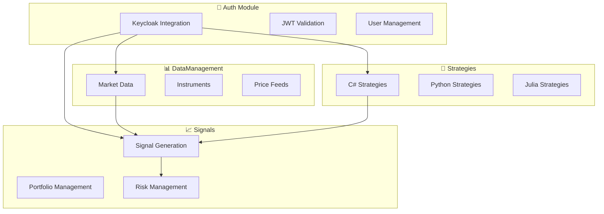

# 📚 Documentação do Bot Sinais - Sistema de Trading

Bem-vindo à documentação completa do **Bot Sinais**, um sistema de sinais de trading baseado em **Domain-Driven Design (DDD)** com arquitetura orientada a eventos.

## 🎯 **Visão Geral do Projeto**

O Bot Sinais é um sistema modular para:
- **📊 Gerenciamento de dados de mercado** (DataManagement)
- **📈 Geração e execução de sinais** (Signals)  
- **🔧 Criação de estratégias multi-linguagem** (Strategies)

### **Tecnologias Principais:**
- **.NET 9.0** com **Aspire** para orquestração
- **Keycloak** para autenticação JWT
- **MassTransit + RabbitMQ** para mensageria
- **PostgreSQL** para persistência
- **Python/Julia** para engines de estratégias

---

## 📁 **Organização da Documentação**

### 🏗️ **[Arquitetura](./arquitetura/)**
- **[README.md](./arquitetura/README.md)** - Índice de documentação de arquitetura
- **[ANALISE_PROJETO_ATUAL.md](./arquitetura/ANALISE_PROJETO_ATUAL.md)** - 📊 **Análise completa do estado atual**
- **[CONFIGURACAO_CENTRALIZADA.md](./arquitetura/CONFIGURACAO_CENTRALIZADA.md)** - 🔧 **Padrão de configuração modular**
- **[ORGANIZACAO_EVENTOS.md](./arquitetura/ORGANIZACAO_EVENTOS.md)** - 📝 **Organização de eventos em arquivos separados**
- **[PROMPT_CONSTRUCAO_BOT.md](./arquitetura/PROMPT_CONSTRUCAO_BOT.md)** - Conceito e arquitetura original
- **[MODULAR_REORGANIZATION_SUMMARY.md](./arquitetura/MODULAR_REORGANIZATION_SUMMARY.md)** - Reorganização modular DDD
- **[RESTRUCTURE_SUMMARY.md](./arquitetura/RESTRUCTURE_SUMMARY.md)** - Resumo de reestruturação

### 🔐 **[Autenticação](./auth/)**
- **[README.md](./auth/README.md)** - Índice completo de autenticação
- **[KEYCLOAK_AUTH_SETUP.md](./auth/KEYCLOAK_AUTH_SETUP.md)** - Setup do Keycloak
- **[ROTAS_AUTENTICACAO.md](./auth/ROTAS_AUTENTICACAO.md)** - APIs de autenticação
- **[IMPLEMENTACAO_LOGIN_LOGOUT.md](./auth/IMPLEMENTACAO_LOGIN_LOGOUT.md)** - Status da implementação

### ⚙️ **[Setup e Configuração](./setup/)**
- **[README.md](./setup/README.md)** - Índice de configuração e setup
- **[SETUP_CONFIGURACAO.md](./setup/SETUP_CONFIGURACAO.md)** - Configuração geral do sistema
- **[ESTRUTURA_RPA_INTEGRACAO.md](./setup/ESTRUTURA_RPA_INTEGRACAO.md)** - 🤖 **Integração com RPAs externos**
- **[MASSTRANSIT_SETUP.md](./setup/MASSTRANSIT_SETUP.md)** - Configuração de mensageria
- **[ORGANIZACAO_HTTP_FILES.md](./setup/ORGANIZACAO_HTTP_FILES.md)** - Organização de arquivos de teste HTTP

### 💡 **[Exemplos](./exemplos/)**
- **[EXEMPLOS_CSHARP_PYTHON.md](./exemplos/EXEMPLOS_CSHARP_PYTHON.md)** - Exemplos de código
- **[EXEMPLOS_IMPLEMENTACAO.md](./exemplos/EXEMPLOS_IMPLEMENTACAO.md)** - Exemplos de implementação

### 📢 **[Marketing](./marketing/)**
- **[ESTRATEGIA_MARKETING_DIGITAL.md](./marketing/ESTRATEGIA_MARKETING_DIGITAL.md)** - Estratégia de marketing
- **[TEMPLATES_CONTEUDO_MARKETING.md](./marketing/TEMPLATES_CONTEUDO_MARKETING.md)** - Templates de conteúdo

---

## 🚀 **Início Rápido**

### **1. Pré-requisitos**
- .NET 9.0 SDK
- Docker Desktop (para Keycloak e PostgreSQL)
- VS Code com REST Client extension

### **2. Executar o Sistema**
```bash
# Navegar para o projeto
cd src-cs/BotSinais.AppHost

# Executar com .NET Aspire
dotnet run
```

### **3. Acessar Dashboards**
- **Aspire Dashboard**: https://localhost:17053
- **Keycloak Admin**: http://localhost:8080/admin
- **API Swagger**: https://localhost:17053/swagger

### **4. Testar Autenticação**
1. Abrir `src-cs/BotSinais.Infrastructure/Modules/Auth/Controllers/AuthController.http`
2. Executar "Autenticação Direta"
3. Verificar se recebeu o JWT token
4. Testar endpoints protegidos

---

## 🏗️ **Arquitetura do Sistema**

### **Contextos Delimitados (DDD)**



### **Fluxo de Dados**
1. **Autenticação** via Keycloak (JWT)
2. **Ingestão** de dados de mercado
3. **Execução** de estratégias (C#/Python/Julia)
4. **Geração** de sinais de trading
5. **Gestão** de risco e portfolio

---

## 📖 **Guias por Funcionalidade**

### 🔐 **Implementar Autenticação**
1. Leia: [Setup do Keycloak](./auth/KEYCLOAK_AUTH_SETUP.md)
2. Configure: [Rotas de Auth](./auth/ROTAS_AUTENTICACAO.md)
3. Teste: [AuthController.http](../src-cs/BotSinais.Infrastructure/Modules/Auth/Controllers/AuthController.http)

### 📊 **Adicionar Dados de Mercado**
1. Configure: DataManagement module
2. Implemente: Market data providers
3. Configure: Entity Framework contexts

### 📈 **Criar Sinais de Trading**
1. Defina: Entities no Domain
2. Implemente: Signal generation logic
3. Configure: MassTransit events

### 🔧 **Desenvolver Estratégias**
1. Escolha: Linguagem (C#/Python/Julia)
2. Implemente: Strategy interface
3. Configure: Execution engines

---

## 🧪 **Testes e Qualidade**

### **Testes Automatizados**
- **Unit Tests**: `BotSinais.Tests/`
- **Integration Tests**: HTTP files nos controllers
- **Load Tests**: Para performance de APIs

### **Arquivos de Teste HTTP**
- **Auth**: `AuthController.http` - Autenticação completa
- **Signals**: `TradingSignalsController.http` - APIs de sinais
- **[Outros módulos]**: Cada controller tem seu arquivo `.http`

### **Monitoramento**
- **Aspire Dashboard**: Métricas e traces
- **Logs**: Estruturados com Serilog
- **Health Checks**: Endpoints de saúde

---

## 📋 **Convenções e Padrões**

### **Código**
- **Linguagem**: C# para APIs, Python/Julia para estratégias
- **Arquitetura**: DDD com bounded contexts
- **Eventos**: MassTransit para comunicação assíncrona
- **Persistência**: Entity Framework Core

### **Documentação**
- **Markdown**: Para toda documentação
- **Diagramas**: Mermaid para fluxos
- **APIs**: OpenAPI/Swagger automático
- **Testes**: Arquivos .http para APIs

### **Versionamento**
- **Git**: Controle de versão
- **Releases**: Semantic versioning
- **Branches**: GitFlow ou GitHub Flow

---

## 🔗 **Links Importantes**

### **Desenvolvimento**
- **Repository**: https://github.com/loribao/bot_sinais
- **Aspire Docs**: https://learn.microsoft.com/aspire
- **Keycloak Docs**: https://www.keycloak.org/documentation

### **Infraestrutura**
- **Local Dashboard**: https://localhost:17053
- **Keycloak Admin**: http://localhost:8080/admin
- **PostgreSQL**: Configurado via Aspire

---

## 📞 **Suporte e Contribuição**

### **Para Desenvolvedores**
1. **Leia** as instruções do Copilot: [copilot-instructions.md](../.github/copilot-instructions.md)
2. **Siga** os padrões estabelecidos nesta documentação
3. **Teste** sempre usando os arquivos HTTP
4. **Documente** novas funcionalidades

### **Estrutura de Ajuda**
1. **Documentação** - Esta pasta docs/
2. **Exemplos** - Pasta exemplos/
3. **Testes** - Arquivos .http nos controllers
4. **Issues** - GitHub Issues para bugs/features

---

**🎯 Objetivo**: Fornecer documentação completa e organizada para facilitar o desenvolvimento e manutenção do sistema Bot Sinais.

**📅 Última atualização**: 30 de julho de 2025  
**👨‍💻 Mantenedor**: Equipe Bot Sinais
