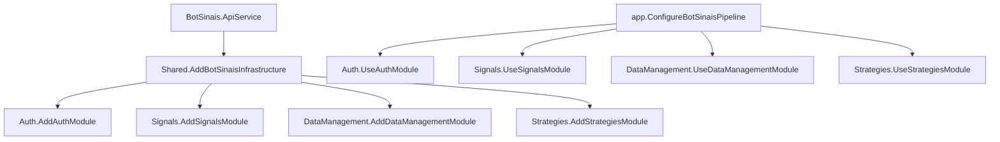

# 🏗️ Estrutura Modular - BotSinais.Infrastructure

## 📋 Visão Geral da Reorganização

A infraestrutura do Bot Sinais foi reorganizada seguindo os **contextos delimitados do DDD**, com cada módulo tendo suas próprias responsabilidades, configurações e controllers.

## 🎯 Estrutura Modular

```
BotSinais.Infrastructure/
├── Modules/
│   ├── Auth/                          # 🔐 Módulo de Autenticação
│   │   ├── Controllers/
│   │   │   ├── AuthController.cs
│   │   │   └── Auth.http
│   │   ├── Services/
│   │   │   ├── AuthInfrastructure.cs
│   │   │   └── AuthenticationErrorMiddleware.cs
│   │   ├── ServiceCollectionExtensions.cs
│   │   └── WebApplicationExtensions.cs
│   │
│   ├── Signals/                       # 📈 Módulo de Sinais de Trading
│   │   ├── Controllers/
│   │   │   ├── TradingSignalsController.cs
│   │   │   └── TradingSignals.http
│   │   ├── Services/
│   │   ├── ServiceCollectionExtensions.cs
│   │   └── WebApplicationExtensions.cs
│   │
│   ├── DataManagement/                # 📊 Módulo de Gerenciamento de Dados
│   │   ├── Controllers/
│   │   ├── Services/
│   │   ├── ServiceCollectionExtensions.cs
│   │   └── WebApplicationExtensions.cs
│   │
│   └── Strategies/                    # 🔧 Módulo de Estratégias
│       ├── Controllers/
│       ├── Services/
│       ├── ServiceCollectionExtensions.cs
│       └── WebApplicationExtensions.cs
│
└── Shared/                           # 🤝 Configurações Unificadas
    ├── ServiceCollectionExtensions.cs
    └── WebApplicationExtensions.cs
```

## 🔧 Configuração por Módulo

### 🔐 Módulo Auth
**Responsabilidades:**
- Autenticação JWT com Keycloak
- Autorização baseada em roles
- Middleware de tratamento de erros
- Controllers de autenticação

**Configuração:**
```csharp
services.AddAuthModule(configuration);
app.UseAuthModule();
```

### 📈 Módulo Signals
**Responsabilidades:**
- Controllers de sinais de trading
- Eventos de MassTransit
- Handlers de sinais
- Serviços de geração de sinais

**Configuração:**
```csharp
services.AddSignalsModule(configuration);
app.UseSignalsModule();
```

### 📊 Módulo DataManagement
**Responsabilidades:**
- Repositórios de dados de mercado
- Entity Framework configuração
- Serviços de provedores de dados
- Controllers de dados

**Configuração:**
```csharp
services.AddDataManagementModule(configuration);
app.UseDataManagementModule();
```

### 🔧 Módulo Strategies
**Responsabilidades:**
- Execução de estratégias C#/Python/Julia
- Backtesting
- Repositórios de estratégias
- Controllers de estratégias

**Configuração:**
```csharp
services.AddStrategiesModule(configuration);
app.UseStrategiesModule();
```

## 🤝 Configuração Unificada (Shared)

O módulo **Shared** centraliza e unifica todas as configurações:

### ServiceCollectionExtensions.cs
```csharp
public static IServiceCollection AddBotSinaisInfrastructure(this IServiceCollection services, IConfiguration configuration)
{
    // Configurações base do ASP.NET Core
    services.AddControllers();
    services.AddOpenApi();
    
    // === TODOS OS MÓDULOS ===
    services.AddAuthModule(configuration);
    services.AddDataManagementModule(configuration);
    services.AddSignalsModule(configuration);
    services.AddStrategiesModule(configuration);
    
    return services;
}
```

### WebApplicationExtensions.cs
```csharp
public static WebApplication ConfigureBotSinaisPipeline(this WebApplication app)
{
    app.UseExceptionHandler();
    
    // === TODOS OS MÓDULOS ===
    app.UseAuthModule();
    app.UseDataManagementModule();
    app.UseSignalsModule();
    app.UseStrategiesModule();
    
    app.MapControllers();
    return app;
}
```

## 🚀 Uso nos Projetos

### BotSinais.ApiService
```csharp
using BotSinais.Infrastructure.Shared;

var builder = WebApplication.CreateBuilder(args);
builder.AddServiceDefaults();

// UMA ÚNICA LINHA para configurar TODOS os módulos
builder.Services.AddBotSinaisInfrastructure(builder.Configuration);
builder.Services.AddBotSinaisApiServices(builder.Configuration);

var app = builder.Build();

// UMA ÚNICA LINHA para configurar TODO o pipeline
app.ConfigureBotSinaisApiPipeline();
app.MapDefaultEndpoints();
app.Run();
```

### BotSinais.Web
```csharp
using BotSinais.Infrastructure.Shared;

var builder = WebApplication.CreateBuilder(args);
builder.AddServiceDefaults();

// UMA ÚNICA LINHA para configurar TODOS os módulos
builder.Services.AddBotSinaisInfrastructure(builder.Configuration);
builder.Services.AddBotSinaisWebServices(builder.Configuration);

var app = builder.Build();

// UMA ÚNICA LINHA para configurar TODO o pipeline
app.ConfigureBotSinaisWebPipeline();
app.Run();
```

## 📈 Benefícios da Estrutura Modular

### ✅ **Separação por Contexto Delimitado**
- Cada módulo reflete um bounded context do DDD
- Responsabilidades claramente definidas
- Fácil localização de funcionalidades

### ✅ **Configuração Centralizada**
- Cada módulo tem suas próprias configurações
- Shared unifica tudo em pontos de entrada únicos
- Fácil manutenção e evolução

### ✅ **Escalabilidade**
- Novos módulos podem ser adicionados facilmente
- Módulos podem ser desenvolvidos independentemente
- Possibilidade de extrair módulos para microserviços

### ✅ **Testabilidade**
- Cada módulo pode ser testado isoladamente
- Mocks mais específicos por contexto
- Testes de integração por módulo

### ✅ **Reutilização**
- Módulos podem ser compartilhados entre projetos
- Configurações específicas por tipo de aplicação
- Facilita a criação de novos projetos

## 🔄 Fluxo de Configuração



## 📝 Próximos Passos

1. **Implementar repositórios** em cada módulo
2. **Adicionar controllers específicos** por contexto
3. **Configurar Entity Framework** no DataManagement
4. **Implementar engines de execução** no Strategies
5. **Adicionar testes unitários** por módulo
6. **Configurar observabilidade** específica por módulo

Esta estrutura modular garante organização, manutenibilidade e escalabilidade seguindo as melhores práticas de DDD e arquitetura .NET moderna!
