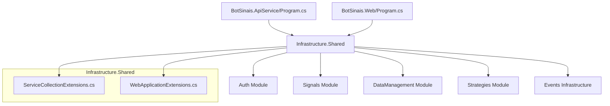

# 🔧 Configuração Centralizada - Bot Sinais

## 📋 Visão Geral

O projeto **Bot Sinais** implementa um padrão de **configuração centralizada** através do módulo `Infrastructure.Shared`, permitindo que todos os projetos (ApiService, Web, etc.) tenham configuração mínima e delegem toda a complexidade para um local unificado.

## 🏗️ Arquitetura da Configuração

### **Fluxo de Configuração**


## 🛠️ Implementação Atual

### **1. ServiceCollectionExtensions.cs**
```csharp
// Infrastructure/Shared/ServiceCollectionExtensions.cs
public static IServiceCollection AddBotSinaisInfrastructure(
    this IServiceCollection services, 
    IConfiguration configuration)
{
    // Configurações base
    services.AddControllers();
    services.AddProblemDetails();
    
    // Todos os módulos
    services.AddAuthModule(configuration);
    services.AddSignalsModule(configuration);
    services.AddDataManagementModule(configuration);
    services.AddStrategiesModule(configuration);
    
    // Sistema de eventos
    services.AddMassTransitWithRabbitMq(configuration);
    services.AddDomainEvents();
    
    return services;
}
```

### **2. WebApplicationExtensions.cs**
```csharp
// Infrastructure/Shared/WebApplicationExtensions.cs
public static WebApplication ConfigureBotSinaisPipeline(this WebApplication app)
{
    // Pipeline comum
    if (app.Environment.IsDevelopment())
    {
        app.UseDeveloperExceptionPage();
    }
    
    app.UseHttpsRedirection();
    app.UseRouting();
    
    // Módulos
    app.UseAuthModule();
    app.UseSignalsModule();
    app.UseDataManagementModule();
    app.UseStrategiesModule();
    
    // Endpoints
    app.MapControllers();
    
    return app;
}
```

### **3. Configuração por Módulo**

#### **Auth Module**
```csharp
// Infrastructure/Modules/Auth/ServiceCollectionExtensions.cs
public static IServiceCollection AddAuthModule(
    this IServiceCollection services, 
    IConfiguration configuration)
{
    // Keycloak configuration
    services.AddAuthKeycloak(configuration);
    
    // Services específicos do Auth
    services.AddScoped<IAuthService, AuthService>();
    
    return services;
}
```

#### **Events Module**
```csharp
// Infrastructure/Events/ServiceCollectionExtensions.cs
public static IServiceCollection AddMassTransitWithRabbitMq(
    this IServiceCollection services, 
    IConfiguration configuration)
{
    services.AddMassTransit(x =>
    {
        x.AddRabbitMqMessageBroker(connectionName: "messaging");
        
        // Handlers
        x.AddConsumer<MarketDataReceivedHandler>();
        x.AddConsumer<SignalGeneratedHandler>();
        x.AddConsumer<SystemErrorHandler>();
    });
    
    return services;
}
```

## 🎯 Projetos com Configuração Mínima

### **BotSinais.ApiService/Program.cs**
```csharp
using BotSinais.Infrastructure.Shared;

var builder = WebApplication.CreateBuilder(args);
builder.AddServiceDefaults();

// 🎯 UMA LINHA - Toda configuração vem do Infrastructure.Shared
builder.Services.AddBotSinaisInfrastructure(builder.Configuration);

var app = builder.Build();

// 🎯 UMA LINHA - Todo pipeline vem do Infrastructure.Shared
app.ConfigureBotSinaisPipeline();
app.MapDefaultEndpoints();

app.Run();
```

### **BotSinais.Web/Program.cs**
```csharp
using BotSinais.Infrastructure.Shared;

var builder = WebApplication.CreateBuilder(args);
builder.AddServiceDefaults();

// 🎯 Configuração compartilhada + Blazor específico
builder.Services.AddBotSinaisInfrastructure(builder.Configuration);
builder.Services.AddRazorPages();
builder.Services.AddServerSideBlazor();
builder.Services.AddAntiforgery();

var app = builder.Build();

// 🎯 Pipeline compartilhado + Web específico
app.ConfigureBotSinaisPipeline();
app.UseStaticFiles();
app.UseAntiforgery();
app.MapRazorPages();
app.MapBlazorHub();
app.MapFallbackToPage("/_Host");
app.MapDefaultEndpoints();

app.Run();
```

## ✅ Benefícios da Configuração Centralizada

### **1. 🔄 Reutilização**
- **Configuração única** para todos os projetos
- **Consistência** entre API e Web
- **Manutenção simplificada**

### **2. 🧩 Modularidade**
- **Separação por contextos** DDD
- **Configuração isolada** por módulo
- **Fácil extensão** para novos módulos

### **3. 🎯 Simplicidade**
- **Program.cs mínimos** nos projetos
- **Configuração declarativa**
- **Menos duplicação de código**

### **4. 🔧 Manutenibilidade**
- **Local único** para mudanças de configuração
- **Versionamento centralizado**
- **Testes de configuração unificados**

## 📊 Status dos Módulos

| Módulo | ServiceCollection | WebApplication | Status |
|--------|------------------|----------------|---------|
| **Auth** | ✅ Implementado | ✅ Implementado | **100%** |
| **Events** | ✅ Implementado | ✅ Implementado | **100%** |
| **Shared** | ✅ Implementado | ✅ Implementado | **100%** |
| **Signals** | 🟡 Estrutura | 🟡 Estrutura | **30%** |
| **DataManagement** | 🟡 Estrutura | 🟡 Estrutura | **30%** |
| **Strategies** | 🟡 Estrutura | 🟡 Estrutura | **30%** |

## 🚀 Próximos Passos

### **1. Implementar Módulos Pendentes**
```csharp
// Signals Module
services.AddScoped<ITradingSignalService, TradingSignalService>();
services.AddScoped<ITradingSignalRepository, TradingSignalRepository>();

// DataManagement Module  
services.AddScoped<IMarketDataService, MarketDataService>();
services.AddScoped<IInstrumentRepository, InstrumentRepository>();

// Strategies Module
services.AddScoped<IStrategyService, StrategyService>();
services.AddScoped<IExecutionEngineService, ExecutionEngineService>();
```

### **2. Entity Framework Configuration**
```csharp
// Configuração de DbContext centralizada
services.AddDbContext<SignalsDbContext>(options =>
    options.UseNpgsql(configuration.GetConnectionString("SignalsDb")));
```

### **3. Swagger/OpenAPI**
```csharp
// Swagger centralizado
services.AddEndpointsApiExplorer();
services.AddSwaggerGen(c =>
{
    c.SwaggerDoc("v1", new OpenApiInfo 
    { 
        Title = "Bot Sinais API", 
        Version = "v1" 
    });
});
```

## 🎨 Padrões de Design

### **Extension Methods Pattern**
- **Cada módulo** tem seus próprios extension methods
- **Composição** no Infrastructure.Shared
- **Isolamento** de responsabilidades

### **Configuration Builder Pattern**
- **Builder fluente** para configuração
- **Configuração condicional** por ambiente
- **Validação** de configurações

### **Module Pattern**
- **Encapsulamento** por contexto DDD
- **Interface consistente** entre módulos
- **Dependências explícitas**

---

**📝 Nota**: Esta configuração centralizada é fundamental para manter a arquitetura DDD limpa e facilitar a manutenção do sistema conforme ele cresce.
