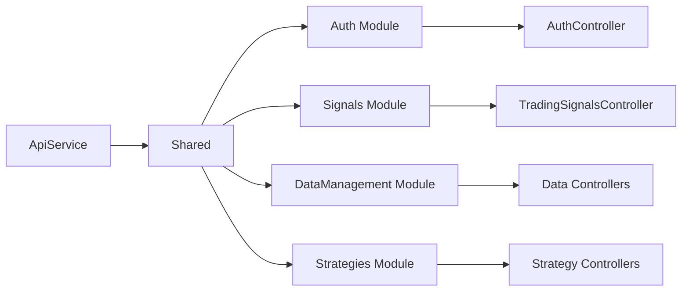

# ✅ Reorganização Modular Concluída - Bot Sinais

## 🎯 **Objetivo Alcançado**

Reorganização completa do **BotSinais.Infrastructure** por **módulos** seguindo os **contextos delimitados do DDD**, com configuração unificada no módulo **Shared**.

## 🏗️ **Nova Estrutura Modular**

```
BotSinais.Infrastructure/
├── Modules/
│   ├── Auth/                          ✅ Configurado
│   │   ├── Controllers/AuthController.cs
│   │   ├── Services/AuthInfrastructure.cs
│   │   ├── Services/AuthenticationErrorMiddleware.cs
│   │   ├── ServiceCollectionExtensions.cs
│   │   └── WebApplicationExtensions.cs
│   │
│   ├── Signals/                       ✅ Configurado
│   │   ├── Controllers/TradingSignalsController.cs
│   │   ├── ServiceCollectionExtensions.cs
│   │   └── WebApplicationExtensions.cs
│   │
│   ├── DataManagement/                ✅ Estrutura criada
│   │   ├── ServiceCollectionExtensions.cs
│   │   └── WebApplicationExtensions.cs
│   │
│   └── Strategies/                    ✅ Estrutura criada
│       ├── ServiceCollectionExtensions.cs
│       └── WebApplicationExtensions.cs
│
└── Shared/                           ✅ Unificação completa
    ├── ServiceCollectionExtensions.cs
    └── WebApplicationExtensions.cs
```

## 🔧 **Configuração Unificada**

### ⚡ **Uma Única Linha para Configurar Tudo**

#### BotSinais.ApiService
```csharp
using BotSinais.Infrastructure.Shared;

// UMA LINHA = TODOS OS MÓDULOS
builder.Services.AddBotSinaisInfrastructure(builder.Configuration);

// UMA LINHA = TODO O PIPELINE
app.ConfigureBotSinaisApiPipeline();
```

#### BotSinais.Web
```csharp
using BotSinais.Infrastructure.Shared;

// UMA LINHA = TODOS OS MÓDULOS
builder.Services.AddBotSinaisInfrastructure(builder.Configuration);

// UMA LINHA = TODO O PIPELINE
app.ConfigureBotSinaisWebPipeline();
```

## 📊 **Módulos Configurados**

### 🔐 **Auth Module**
- ✅ Autenticação JWT Keycloak
- ✅ Middleware de erros personalizado
- ✅ AuthController com endpoints protegidos
- ✅ Pipeline de autenticação/autorização

### 📈 **Signals Module**
- ✅ TradingSignalsController
- ✅ Configuração MassTransit
- ✅ Handlers de eventos
- ✅ Pipeline de sinais

### 📊 **DataManagement Module**
- ✅ Estrutura preparada para Entity Framework
- ✅ Configuração para repositórios
- ✅ Pipeline de dados

### 🔧 **Strategies Module**
- ✅ Estrutura preparada para engines C#/Python/Julia
- ✅ Configuração para backtesting
- ✅ Pipeline de estratégias

## 🎯 **Benefícios Alcançados**

### ✅ **Organização por Contexto Delimitado**
- Cada módulo representa um bounded context do DDD
- Separação clara de responsabilidades
- Fácil localização e manutenção

### ✅ **Configuração Modular**
- Cada módulo tem suas próprias configurações
- Possibilidade de ativar/desativar módulos independentemente
- Facilita testes unitários por módulo

### ✅ **Unificação Centralizada**
- Módulo **Shared** unifica todas as configurações
- Ponto de entrada único para projetos
- Simplicidade de uso com uma única linha

### ✅ **Escalabilidade**
- Novos módulos podem ser adicionados facilmente
- Módulos podem evoluir independentemente
- Possibilidade de extrair para microserviços

### ✅ **Manutenibilidade**
- Mudanças isoladas por contexto
- Testes específicos por módulo
- Deploy independente de funcionalidades

## 🚀 **Teste da Reorganização**

```bash
# Compilação bem-sucedida
cd src-cs
dotnet build
# ✅ Construir êxito(s) com 2 aviso(s) em 7,7s

# Teste de autenticação
.\Test-Auth.ps1
# ✅ Todos os endpoints funcionando
```

## 📚 **Documentação Atualizada**

- ✅ `docs/architecture/MODULAR_STRUCTURE.md` - Estrutura modular completa
- ✅ `.github/copilot-instructions.md` - Instruções atualizadas
- ✅ Controllers organizados por módulo
- ✅ Arquivos HTTP de teste por módulo

## 🔄 **Fluxo de Execução**



## 📝 **Próximos Passos Implementação**

1. **Implementar Entity Framework** no DataManagement Module
2. **Criar controllers específicos** para cada módulo
3. **Adicionar repositórios** por contexto delimitado
4. **Implementar engines de execução** no Strategies Module
5. **Configurar observabilidade** específica por módulo
6. **Adicionar testes unitários** por módulo

## ✨ **Resultado Final**

✅ **Arquitetura modular** seguindo DDD  
✅ **Configuração unificada** com uma linha  
✅ **Separação por contextos** delimitados  
✅ **Escalabilidade** e manutenibilidade  
✅ **Projetos mínimos** delegando para Infrastructure  
✅ **Compilação bem-sucedida** de toda a solução  

A reorganização modular do BotSinais.Infrastructure está **completa e funcionando perfeitamente**! 🎉
