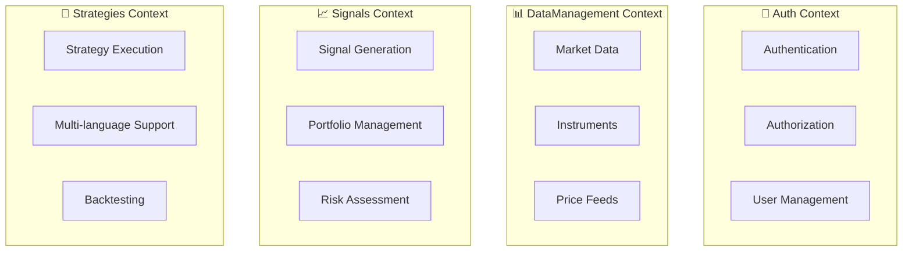

# 🏗️ Documentação de Arquitetura - Bot Sinais

Esta pasta contém documentação sobre a arquitetura, design e evolução estrutural do sistema Bot Sinais.

## 📋 **Documentos Disponíveis**

### 🎯 **Conceito e Design Original**
- **[PROMPT_CONSTRUCAO_BOT.md](./PROMPT_CONSTRUCAO_BOT.md)**
  - Conceito original do sistema
  - Arquitetura planejada
  - Contextos delimitados (DDD)
  - Tecnologias escolhidas

### 📊 **Análise do Estado Atual**
- **[ANALISE_PROJETO_ATUAL.md](./ANALISE_PROJETO_ATUAL.md)**
  - Status detalhado de implementação
  - Análise arquitetural completa
  - Inventário de funcionalidades
  - Plano de desenvolvimento recomendado
  - Estimativas de esforço

### 🔧 **Configuração e Implementação**
- **[CONFIGURACAO_CENTRALIZADA.md](./CONFIGURACAO_CENTRALIZADA.md)**
  - Padrão de configuração centralizada
  - Infrastructure.Shared pattern
  - Configuração modular por contexto DDD
  - Benefícios e implementação atual

### 🔄 **Evolução da Arquitetura**

#### **Reorganização Modular**
- **[MODULAR_REORGANIZATION_SUMMARY.md](./MODULAR_REORGANIZATION_SUMMARY.md)**
  - Reorganização por módulos DDD
  - Nova estrutura do Infrastructure
  - Configuração unificada no Shared
  - Status de implementação

#### **Reestruturação Geral**
- **[RESTRUCTURE_SUMMARY.md](./RESTRUCTURE_SUMMARY.md)**
  - Resumo das reestruturações realizadas
  - Mudanças arquiteturais importantes
  - Impactos e benefícios

## 🏛️ **Princípios Arquiteturais**

### **Domain-Driven Design (DDD)**
O sistema é organizado em **contextos delimitados**:



### **Arquitetura em Camadas**

```
┌─────────────────────────────────────┐
│           🌐 Presentation           │  ← Web UI, APIs, Controllers
├─────────────────────────────────────┤
│          💼 Application             │  ← Use Cases, Handlers, DTOs
├─────────────────────────────────────┤
│            🏛️ Domain                │  ← Entities, Value Objects, Events
├─────────────────────────────────────┤
│         🔧 Infrastructure           │  ← External Services, Databases
└─────────────────────────────────────┘
```

### **Arquitetura Orientada a Eventos**
- **MassTransit + RabbitMQ** para comunicação assíncrona
- **Domain Events** para desacoplamento
- **Event Sourcing** para auditoria (futuro)

## 🛠️ **Tecnologias por Camada**

### **🌐 Presentation**
- **ASP.NET Core** - APIs REST
- **Blazor** - Interface web
- **Swagger/OpenAPI** - Documentação de APIs

### **💼 Application**
- **MediatR** - CQRS pattern
- **FluentValidation** - Validação de comandos
- **AutoMapper** - Mapeamento de objetos

### **🏛️ Domain**
- **C# Records** - Value Objects
- **Domain Events** - Comunicação
- **Repository Pattern** - Abstração de dados

### **🔧 Infrastructure**
- **.NET Aspire** - Orquestração
- **Entity Framework Core** - ORM
- **Keycloak** - Autenticação
- **PostgreSQL** - Banco de dados
- **RabbitMQ** - Message Broker

## 📁 **Estrutura Modular**

### **BotSinais.Infrastructure/Modules/**

```
Modules/
├── Auth/                    # 🔐 Contexto de Autenticação
│   ├── Controllers/         # Controllers HTTP
│   ├── Services/           # Serviços de infraestrutura
│   ├── ServiceCollectionExtensions.cs
│   └── WebApplicationExtensions.cs
│
├── Signals/                # 📈 Contexto de Sinais
│   ├── Controllers/        # APIs de sinais
│   ├── Handlers/          # Event handlers
│   └── [configurações...]
│
├── DataManagement/         # 📊 Contexto de Dados
│   ├── Controllers/       # APIs de dados
│   ├── Repositories/      # Implementações EF
│   └── [configurações...]
│
├── Strategies/            # 🔧 Contexto de Estratégias
│   ├── Controllers/       # APIs de estratégias
│   ├── Engines/          # Engines C#/Python/Julia
│   └── [configurações...]
│
└── Shared/               # 🔗 Configuração Unificada
    ├── ServiceCollectionExtensions.cs  # DI de todos os módulos
    └── WebApplicationExtensions.cs     # Pipeline unificado
```

## 🔀 **Padrões de Integração**

### **Entre Contextos**
- **Domain Events** - Comunicação assíncrona
- **Anti-Corruption Layer** - Proteção de domínio
- **Published Language** - Contratos de integração

### **Com Sistemas Externos**
- **Adapter Pattern** - APIs externas
- **Circuit Breaker** - Resiliência
- **Retry Policies** - Tolerância a falhas

## 📊 **Métricas de Arquitetura**

### **Qualidade**
- **Baixo Acoplamento** - Contextos independentes
- **Alta Coesão** - Responsabilidades bem definidas
- **Testabilidade** - Dependências injetáveis

### **Performance**
- **Async/Await** - Operations não-bloqueantes
- **Caching** - Redução de latência
- **Connection Pooling** - Eficiência de recursos

### **Escalabilidade**
- **Stateless APIs** - Escalabilidade horizontal
- **Message Queues** - Processamento assíncrono
- **Microservices Ready** - Divisão futura

## 🎯 **Decisões Arquiteturais**

### **✅ Decidido**
1. **DDD** como abordagem principal
2. **.NET Aspire** para orquestração
3. **Keycloak** para autenticação
4. **MassTransit** para messaging
5. **PostgreSQL** como banco principal

### **🤔 Em Avaliação**
1. **Event Sourcing** - Para auditoria completa
2. **CQRS** - Separação comando/query
3. **Microservices** - Divisão por contexto
4. **Container Orchestration** - Kubernetes

### **🚫 Rejeitado**
1. **Monolith** - Baixa escalabilidade
2. **In-Memory DB** - Perda de dados
3. **REST para tudo** - Latência alta para events

## 📚 **Recursos de Estudo**

### **Domain-Driven Design**
- [DDD Reference](https://domainlanguage.com/ddd/reference/)
- [Implementing DDD](https://vaughnvernon.com/)

### **.NET Aspire**
- [Microsoft Aspire Docs](https://learn.microsoft.com/aspire)
- [Aspire Samples](https://github.com/dotnet/aspire-samples)

### **Event-Driven Architecture**
- [Building Event-Driven Microservices](https://www.oreilly.com/library/view/building-event-driven-microservices/9781492057888/)

---

**📅 Última atualização**: 30 de julho de 2025  
**🏗️ Status**: Arquitetura modular implementada e funcional
