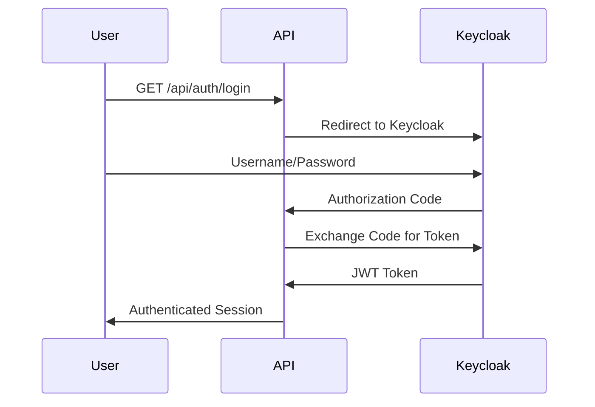
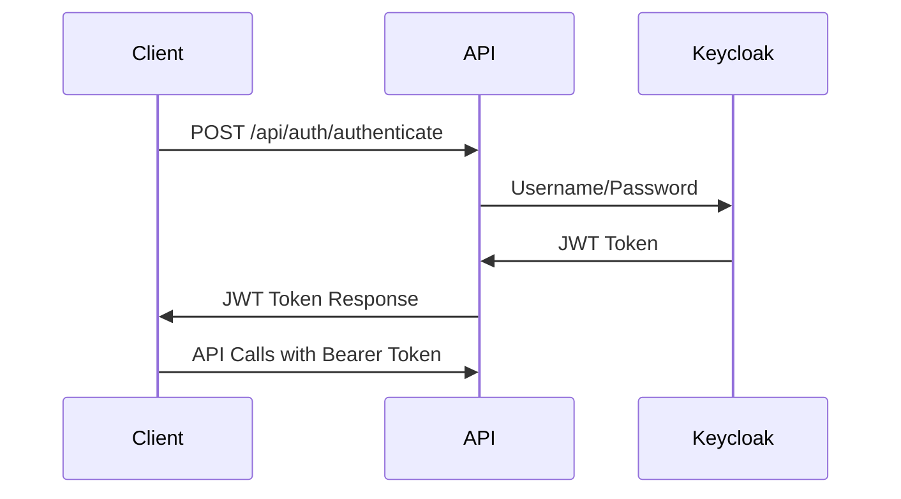

# 📚 Documentação de Autenticação - Bot Sinais

Este diretório contém toda a documentação relacionada à autenticação e autorização do sistema Bot Sinais.

## 📋 **Índice de Documentos**

### 🔧 **Setup e Configuração**
- **[KEYCLOAK_AUTH_SETUP.md](./KEYCLOAK_AUTH_SETUP.md)** - Configuração completa do Keycloak
  - Configuração do realm `botsignals`
  - Criação do client `bot-signal-api`
  - Configuração de usuários de teste
  - Configuração ROPC (Resource Owner Password Credentials)

### 📖 **Documentação de APIs**
- **[ROTAS_AUTENTICACAO.md](./ROTAS_AUTENTICACAO.md)** - Documentação completa das rotas de autenticação
  - Endpoints disponíveis
  - Parâmetros e respostas
  - Exemplos de uso
  - Códigos de erro

### ✅ **Implementação Concluída**
- **[IMPLEMENTACAO_LOGIN_LOGOUT.md](./IMPLEMENTACAO_LOGIN_LOGOUT.md)** - Status da implementação
  - Rotas implementadas e funcionais
  - Configurações adicionadas
  - Testes realizados
  - Fluxos de autenticação
  - Como testar o sistema

## 🔄 **Fluxos de Autenticação Disponíveis**

### 1. **Web Flow (Authorization Code)**


### 2. **API Flow (ROPC - Resource Owner Password Credentials)**


## 🛡️ **Validação de Token**

### **Métodos Disponíveis:**

1. **Validação via API** - `/api/auth/validate`
   - Validação local usando chaves públicas do Keycloak
   - Mais rápida para validações frequentes

2. **Token Introspection** - Keycloak diretamente
   - Validação autoritativa no Keycloak
   - Verifica se token está ativo/revogado

3. **UserInfo Endpoint** - `/api/auth/me`
   - Informações do usuário autenticado
   - Claims e roles disponíveis

## 🧪 **Testes**

Todos os testes estão disponíveis no arquivo:
```
src-cs/BotSinais.Infrastructure/Modules/Auth/Controllers/AuthController.http
```

### **Grupos de Teste:**
- ✅ **Conectividade** - Verificação de serviços
- ✅ **Autenticação** - Login e obtenção de tokens
- ✅ **Validação** - Verificação de tokens
- ✅ **Endpoints Protegidos** - APIs que requerem autenticação
- ✅ **Logout** - Encerramento de sessão

## 📁 **Estrutura de Arquivos**

```
docs/auth/
├── README.md                           # Este arquivo
├── KEYCLOAK_AUTH_SETUP.md             # Setup do Keycloak
├── ROTAS_AUTENTICACAO.md              # Documentação das APIs
└── IMPLEMENTACAO_LOGIN_LOGOUT.md      # Status da implementação

src-cs/BotSinais.Infrastructure/Modules/Auth/
├── Controllers/
│   ├── AuthController.cs              # Controller de autenticação
│   └── AuthController.http            # Testes HTTP
└── [outros módulos de auth...]
```

## 🔗 **Links Úteis**

- **Dashboard Aspire**: https://localhost:17053
- **Keycloak Admin**: http://localhost:8080/admin
- **API Base URL**: https://localhost:17053/api/auth
- **Realm Keycloak**: http://localhost:8080/realms/botsignals

## 🚀 **Início Rápido**

1. **Iniciar o sistema:**
   ```bash
   cd src-cs/BotSinais.AppHost
   dotnet run
   ```

2. **Testar autenticação:**
   - Abrir `AuthController.http` no VS Code
   - Executar "Autenticação Direta"
   - Verificar se o token foi capturado automaticamente

3. **Validar token:**
   - Executar "Validar Token JWT"
   - Executar "Validação via Keycloak"

## 📞 **Suporte**

Para dúvidas sobre autenticação:
1. Consulte primeiro esta documentação
2. Verifique os logs no dashboard Aspire
3. Teste endpoints usando o arquivo HTTP
4. Verifique configurações no Keycloak Admin

---

**Última atualização:** 30 de julho de 2025
**Versão:** 1.0 - Implementação completa funcional
