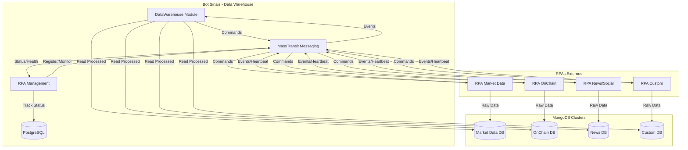

# 🤖 Estrutura para Integração com RPAs - Data Warehouse

## 📋 Visão Geral

Esta documentação define a estrutura mínima que os **RPAs (Robotic Process Automation)** devem seguir para integração com o módulo Data Warehouse do Bot Sinais via **mensageria (MassTransit + RabbitMQ)** e **MongoDB**.

## 🏗️ Arquitetura de Integração



## 🎯 Funcionalidades do Sistema

### 1. Gerenciamento de RPAs
- **Registro**: Cadastro de instâncias RPA no sistema
- **Monitoramento**: Acompanhamento de status (online/offline) e saúde
- **Configuração**: Definição de parâmetros de coleta por RPA
- **Histórico**: Log completo de atividades e execuções

### 2. Coleta de Dados
- **Market Data**: Preços, volumes, orderbook de mercados tradicionais
- **OnChain Data**: Transações, contratos, métricas de blockchain
- **News & Social**: Notícias, sentiment, redes sociais
- **Custom Data**: Dados específicos definidos pelo usuário

### 3. Processamento e Armazenamento
- **Raw Storage**: MongoDB para dados brutos coletados
- **Data Transformation**: Limpeza e padronização de dados
- **Quality Control**: Validação e scoring de qualidade
- **Metadata Management**: Controle de origem e linhagem

## 📨 Protocolo de Mensageria

### **🤖 Gerenciamento de Instâncias RPA**

#### **Registro de RPA**
```json
// Comando: RpaRegisteredEvent
{
  "rpaInstanceId": "uuid",
  "name": "RPA-MarketData-001",
  "type": "MarketData",
  "description": "RPA para coleta de dados do Binance",
  "capabilities": ["BinanceAPI", "WebSocket", "HistoricalData"],
  "maxConcurrentRequests": 5,
  "registeredAt": "2025-01-23T10:00:00Z",
  "version": "1.0.0"
}
```

#### **Heartbeat de RPA**
```json
// Evento: RpaHeartbeatEvent (a cada 30 segundos)
{
  "rpaInstanceId": "uuid",
  "timestamp": "2025-01-23T10:00:30Z",
  "status": "Online|Offline|Busy|Error",
  "activeRequests": 2,
  "systemResources": {
    "cpuUsage": 45.5,
    "memoryUsage": 512.0,
    "availableConnections": 8
  },
  "lastSuccessfulCollection": "2025-01-23T09:58:15Z"
}
```

#### **Health Check de RPA**
```json
// Evento: RpaHealthCheckEvent (a cada 5 minutos)
{
  "rpaInstanceId": "uuid",
  "timestamp": "2025-01-23T10:05:00Z",
  "isHealthy": true,
  "responseTime": "00:00:01.234",
  "healthMetrics": {
    "successRate": 98.5,
    "averageResponseTime": "00:00:02.100",
    "errorsInLastHour": 1,
    "uptime": "1.12:30:00" // 1 dia, 12h, 30min
  }
}
```

### **1. Comandos enviados pelo Data Warehouse**

#### **🚀 StartDataCollectionCommand**
```json
{
  "requestId": "uuid",
  "rpaType": "MarketData|OnChain|News|Social",
  "dataSource": "Binance|Coinbase|Etherscan|Twitter|etc",
  "symbol": "BTC/USDT", // opcional
  "timeFrame": "M1|M5|H1|D1", // opcional
  "startDate": "2025-01-01T00:00:00Z", // opcional
  "endDate": "2025-01-31T23:59:59Z", // opcional
  "parameters": {
    "apiKey": "reference_to_credentials",
    "limit": 1000,
    "customParam": "value"
  },
  "priority": 5, // 1-10
  "timeout": "00:30:00" // 30 minutos
}
```

#### **🛑 StopDataCollectionCommand**
```json
{
  "requestId": "uuid",
  "rpaType": "MarketData",
  "dataSource": "Binance",
  "reason": "Manual stop | Timeout | Error"
}
```

#### **⚙️ ConfigureDataCollectionCommand**
```json
{
  "rpaType": "MarketData",
  "dataSource": "Binance",
  "configuration": {
    "collectionInterval": "00:01:00",
    "retryAttempts": 3,
    "retryDelay": "00:00:30",
    "batchSize": 1000
  }
}
```

### **2. Eventos enviados pelos RPAs**

#### **📊 DataCollectionStatusEvent**
```json
{
  "requestId": "uuid",
  "rpaType": "MarketData",
  "dataSource": "Binance",
  "status": "Started|Running|Completed|Failed|Stopped",
  "message": "Coletando dados OHLCV para BTC/USDT",
  "metadata": {
    "currentSymbol": "BTC/USDT",
    "currentTimeFrame": "M1",
    "progress": "50%"
  },
  "lastActivity": "2025-01-30T10:30:00Z",
  "recordsProcessed": 1500,
  "errorDetails": null
}
```

#### **💾 DataAvailableEvent**
```json
{
  "requestId": "uuid",
  "rpaType": "MarketData",
  "dataSource": "Binance",
  "collectionName": "binance_btc_usdt_m1",
  "databaseName": "market_data",
  "dataType": "MarketData",
  "symbol": "BTC/USDT",
  "timeFrame": "M1",
  "dataTimestamp": "2025-01-30T10:30:00Z",
  "recordCount": 1440, // 24 horas * 60 minutos
  "dataSizeBytes": 2048576,
  "schema": {
    "timestamp": "datetime",
    "open": "decimal",
    "high": "decimal",
    "low": "decimal",
    "close": "decimal",
    "volume": "decimal"
  },
  "qualityScore": "High|Medium|Low"
}
```

#### **❌ RpaErrorEvent**
```json
{
  "requestId": "uuid",
  "rpaType": "MarketData",
  "dataSource": "Binance",
  "errorType": "Connection|Authentication|RateLimit|Parsing|Unknown",
  "errorMessage": "Rate limit exceeded: 1200 requests per minute",
  "stackTrace": "...",
  "context": {
    "endpoint": "https://api.binance.com/api/v3/klines",
    "httpStatusCode": 429,
    "retryAfter": 60
  },
  "isRetryable": true,
  "attemptNumber": 2,
  "nextRetryAt": "2025-01-30T10:31:00Z"
}
```

## 🏛️ Estrutura de Domínio

### **📁 Entidades Principais**

#### **RpaInstance** - Gerenciamento de Instâncias RPA
```csharp
public class RpaInstance : BaseEntity
{
    public string Name { get; set; }
    public RpaType Type { get; set; }
    public RpaInstanceStatus Status { get; set; }
    public DateTime LastHeartbeat { get; set; }
    public DateTime RegisteredAt { get; set; }
    public int MaxConcurrentRequests { get; set; }
    public int CurrentActiveRequests { get; set; }
    public List<string> Capabilities { get; set; }
    
    // Métodos de negócio
    public bool IsOnline() { /* lógica */ }
    public bool CanAcceptNewRequest() { /* lógica */ }
    public void UpdateHeartbeat() { /* lógica */ }
    public void IncrementActiveRequests() { /* lógica */ }
    public void DecrementActiveRequests() { /* lógica */ }
}
```

#### **RpaHealthCheck** - Monitoramento de Saúde
```csharp
public class RpaHealthCheck : BaseEntity
{
    public Guid RpaInstanceId { get; set; }
    public DateTime CheckTime { get; set; }
    public bool IsHealthy { get; set; }
    public TimeSpan ResponseTime { get; set; }
    public double SuccessRate { get; set; }
    public TimeSpan AverageResponseTime { get; set; }
    public int ErrorsInLastHour { get; set; }
    public TimeSpan Uptime { get; set; }
}
```

#### **RpaConfiguration** - Configuração de Coleta
```csharp
public class RpaConfiguration : BaseEntity
{
    public Guid RpaInstanceId { get; set; } // Referência para RpaInstance
    public RpaType Type { get; set; }
    public string DataSource { get; set; }
    public MongoConfiguration MongoConfig { get; set; }
    public Dictionary<string, object> Parameters { get; set; }
    public bool IsActive { get; set; }
}
```

### **🔧 Interfaces de Serviço**

#### **IRpaInstanceRepository**
```csharp
public interface IRpaInstanceRepository
{
    Task<RpaInstance> GetByIdAsync(Guid id);
    Task<List<RpaInstance>> GetByTypeAsync(RpaType type);
    Task<List<RpaInstance>> GetOnlineInstancesAsync();
    Task<List<RpaInstance>> GetAvailableInstancesAsync();
    Task<RpaInstance> CreateAsync(RpaInstance rpaInstance);
    Task UpdateAsync(RpaInstance rpaInstance);
    Task DeleteAsync(Guid id);
}
```

#### **IRpaInstanceManagementService**
```csharp
public interface IRpaInstanceManagementService
{
    Task<RegisterRpaInstanceResponse> RegisterInstanceAsync(RegisterRpaInstanceRequest request);
    Task<UpdateRpaInstanceResponse> UpdateInstanceAsync(UpdateRpaInstanceRequest request);
    Task<GetRpaInstanceResponse> GetInstanceAsync(Guid rpaInstanceId);
    Task<List<RpaInstanceSummaryDto>> GetAllInstancesAsync();
    Task<List<RpaInstanceSummaryDto>> GetInstancesByTypeAsync(RpaType type);
    Task<List<RpaInstanceSummaryDto>> GetAvailableInstancesAsync();
    Task<DeleteRpaInstanceResponse> UnregisterInstanceAsync(Guid rpaInstanceId);
}
```

#### **IRpaMonitoringService**
```csharp
public interface IRpaMonitoringService
{
    Task ProcessHeartbeatAsync(RpaHeartbeatEvent heartbeat);
    Task ProcessHealthCheckAsync(RpaHealthCheckEvent healthCheck);
    Task<List<RpaInstanceHealthDto>> GetInstancesHealthStatusAsync();
    Task<RpaInstanceHealthDto> GetInstanceHealthAsync(Guid rpaInstanceId);
    Task<bool> IsInstanceHealthyAsync(Guid rpaInstanceId);
    Task MarkInstanceAsOfflineAsync(Guid rpaInstanceId);
}
```

## 📁 Estrutura MongoDB Padrão

### **1. 📊 Dados de Mercado (Market Data)**

#### **Database**: `market_data`
#### **Collections**: `{exchange}_{symbol}_{timeframe}`

**Exemplo**: `binance_btc_usdt_m1`

```json
{
  "_id": "ObjectId",
  "timestamp": "2025-01-30T10:30:00.000Z",
  "symbol": "BTC/USDT",
  "exchange": "Binance",
  "timeframe": "M1",
  "open": 95000.50,
  "high": 95150.75,
  "low": 94950.25,
  "close": 95100.00,
  "volume": 125.5678,
  "volume_usd": 11936420.75,
  "trades_count": 1543,
  "metadata": {
    "rpa_request_id": "uuid",
    "collected_at": "2025-01-30T10:31:15.000Z",
    "data_source": "Binance API v3",
    "quality_score": "High"
  },
  "created_at": "2025-01-30T10:31:15.000Z"
}
```

### **2. ⛓️ Dados On-Chain**

#### **Database**: `onchain_data`
#### **Collections**: `{blockchain}_{metric_type}`

**Exemplo**: `ethereum_daily_metrics`

```json
{
  "_id": "ObjectId",
  "timestamp": "2025-01-30T00:00:00.000Z",
  "blockchain": "Ethereum",
  "symbol": "ETH",
  "date": "2025-01-30",
  "metrics": {
    "active_addresses": 567890,
    "new_addresses": 45672,
    "transaction_count": 1234567,
    "transaction_volume_eth": 2345678.90,
    "transaction_volume_usd": 7890123456.78,
    "average_gas_price": 25.5,
    "network_hash_rate": 850000000000000,
    "difficulty": 58750003716598352816469
  },
  "defi_metrics": {
    "total_value_locked": 45678901234.56,
    "dex_volume_24h": 1234567890.12,
    "lending_volume": 567890123.45
  },
  "holder_metrics": {
    "total_holders": 98765432,
    "whale_addresses": 12345,
    "top_100_percentage": 15.67
  },
  "metadata": {
    "rpa_request_id": "uuid",
    "collected_at": "2025-01-30T01:00:00.000Z",
    "data_sources": ["Etherscan", "DeFiPulse", "CoinMetrics"],
    "quality_score": "High"
  },
  "created_at": "2025-01-30T01:00:00.000Z"
}
```

### **3. 📰 Dados de Notícias/Social**

#### **Database**: `news_social`
#### **Collections**: `news`, `social_sentiment`, `reddit_posts`, `twitter_mentions`

**Exemplo**: `news`

```json
{
  "_id": "ObjectId",
  "timestamp": "2025-01-30T10:30:00.000Z",
  "title": "Bitcoin Reaches New All-Time High",
  "content": "Bitcoin surged to a new record high of $95,000...",
  "source": "CoinDesk",
  "url": "https://coindesk.com/...",
  "author": "John Smith",
  "category": "Cryptocurrency",
  "symbols_mentioned": ["BTC", "ETH"],
  "sentiment": {
    "score": 0.75, // -1 to 1
    "label": "Positive",
    "confidence": 0.89
  },
  "impact_score": 8.5, // 1-10
  "tags": ["bitcoin", "ath", "bullish", "market"],
  "metadata": {
    "rpa_request_id": "uuid",
    "collected_at": "2025-01-30T10:31:00.000Z",
    "data_source": "News API",
    "quality_score": "High"
  },
  "created_at": "2025-01-30T10:31:00.000Z"
}
```

## 🔧 Especificações Técnicas para RPAs

### **1. ⚡ Padrões de Performance**

```yaml
Performance_Requirements:
  Collection_Speed:
    market_data: "> 1000 records/minute"
    onchain_data: "> 100 records/minute"
    news_data: "> 500 records/minute"
    
  Latency:
    real_time_data: "< 30 seconds"
    historical_data: "< 5 minutes"
    
  Availability:
    uptime: "> 99.5%"
    error_rate: "< 1%"
    
  Resource_Usage:
    memory: "< 2GB per RPA"
    cpu: "< 50% single core"
    network: "< 10 Mbps sustained"
```

### **2. 🛡️ Tratamento de Erros**

```csharp
// Padrão de retry para RPAs
RetryPolicy:
  - Exponential backoff: 1s, 2s, 4s, 8s, 16s
  - Max attempts: 5
  - Circuit breaker após 10 erros consecutivos
  - Retry apenas para erros retriáveis (5xx, timeout, network)
  - Não retry para 4xx (auth, permission, bad request)
```

### **3. 📝 Logging e Monitoramento**

```json
{
  "log_level": "Info|Warning|Error",
  "timestamp": "2025-01-30T10:30:00.000Z",
  "rpa_type": "MarketData",
  "data_source": "Binance",
  "request_id": "uuid",
  "message": "Collected 1440 records for BTC/USDT M1",
  "context": {
    "method": "CollectOHLCV",
    "symbol": "BTC/USDT",
    "timeframe": "M1",
    "records_collected": 1440,
    "duration_ms": 2500
  },
  "metadata": {
    "version": "1.0.0",
    "environment": "production"
  }
}
```

## 🔒 Segurança e Autenticação

### **1. 🔐 Credenciais**

```yaml
Security_Guidelines:
  Credentials:
    storage: "Azure Key Vault | AWS Secrets Manager"
    reference: "credential_reference_id"
    rotation: "Automatic every 90 days"
    
  API_Keys:
    encryption: "AES-256"
    access: "Role-based (RBAC)"
    audit: "All access logged"
    
  Database_Access:
    mongodb_connection: "TLS 1.3 required"
    authentication: "X.509 certificates"
    authorization: "Database-level permissions"
```

### **2. 🛠️ Configuração RPA**

```yaml
# Exemplo de configuração para RPA Market Data
rpa_config:
  name: "Binance Market Data Collector"
  type: "MarketData"
  data_source: "Binance"
  
  collection:
    interval: "00:01:00" # 1 minuto
    batch_size: 1000
    timeout: "00:05:00" # 5 minutos
    
  retry:
    max_attempts: 3
    delay: "00:00:30" # 30 segundos
    backoff_multiplier: 2
    
  mongodb:
    database: "market_data"
    collection_template: "{exchange}_{symbol}_{timeframe}"
    indexes:
      - field: "timestamp"
        type: "ascending"
      - field: ["symbol", "timestamp"]
        type: "compound"
    
  api:
    base_url: "https://api.binance.com"
    rate_limit: 1200 # requests per minute
    credentials_ref: "binance_api_key_prod"
    
  monitoring:
    health_check_interval: "00:05:00"
    metrics_collection: true
    alert_on_failure: true
```

## 📊 Qualidade de Dados

### **1. ✅ Validações Obrigatórias**

```yaml
Data_Quality_Checks:
  Market_Data:
    - timestamp: "Valid UTC datetime"
    - ohlc: "High >= Low, Close between Low and High"
    - volume: "> 0"
    - no_duplicates: "timestamp + symbol unique"
    
  OnChain_Data:
    - metrics: "All positive numbers"
    - consistency: "Active addresses <= Total addresses"
    - completeness: "> 95% of expected fields"
    
  News_Data:
    - content: "Not empty, > 50 characters"
    - timestamp: "Recent (< 24h old for real-time)"
    - sentiment: "Score between -1 and 1"
```

### **2. 📈 Métricas de Qualidade**

```csharp
// Score de qualidade calculado pelos RPAs
QualityScore Calculation:
  - Completeness: % of required fields filled
  - Accuracy: % of data passing validation
  - Timeliness: Delay from source timestamp
  - Consistency: No contradictions in data
  - Uniqueness: No duplicate records
  
  // Score final: média ponderada
  Final Score = (Completeness * 0.3) + 
                (Accuracy * 0.3) + 
                (Timeliness * 0.2) + 
                (Consistency * 0.15) + 
                (Uniqueness * 0.05)
                
  // Classificação
  - High: >= 0.9
  - Medium: 0.7 - 0.89
  - Low: < 0.7
```

## 🚀 Implementação Recomendada

### **1. 📋 Checklist para RPAs**

```yaml
Required_Implementation:
  Messaging:
    ✓ MassTransit consumer para comandos
    ✓ MassTransit publisher para eventos
    ✓ Error handling com retry policy
    ✓ Dead letter queue para falhas
    
  Data_Storage:
    ✓ MongoDB connection com TLS
    ✓ Batch insert para performance
    ✓ Proper indexing strategy
    ✓ TTL para cleanup automático
    
  Monitoring:
    ✓ Health check endpoint
    ✓ Metrics collection (Prometheus)
    ✓ Structured logging (JSON)
    ✓ Distributed tracing
    
  Configuration:
    ✓ Environment-based config
    ✓ Secrets management
    ✓ Feature flags
    ✓ Dynamic reconfiguration
```

### **2. 🛠️ Tecnologias Recomendadas**

```yaml
Technology_Stack:
  Language: "C# (.NET 8+) | Python 3.11+ | Node.js 18+"
  
  Messaging:
    - "MassTransit (C#)"
    - "Celery (Python)"
    - "Bull/BullMQ (Node.js)"
    
  MongoDB:
    - "MongoDB.Driver (C#)"
    - "PyMongo/Motor (Python)"
    - "Mongoose (Node.js)"
    
  Monitoring:
    - "Serilog/NLog (C#)"
    - "Loguru (Python)"
    - "Winston (Node.js)"
    
  Testing:
    - "xUnit + Testcontainers (C#)"
    - "pytest + testcontainers (Python)"
    - "Jest + testcontainers (Node.js)"
```

## 🎯 Casos de Uso Exemplos

### **1. 📊 Coleta de Dados OHLCV**

```yaml
Use_Case: "Coletar dados OHLCV de criptomoedas"
Steps:
  1. Data Warehouse envia StartDataCollectionCommand
  2. RPA valida parâmetros e responde com Started status
  3. RPA coleta dados da API da exchange
  4. RPA valida e processa dados
  5. RPA salva em lotes no MongoDB
  6. RPA envia DataAvailableEvent para cada lote
  7. RPA envia Completed status ao finalizar
  8. Data Warehouse processa dados do MongoDB
```

### **2. ⛓️ Coleta de Métricas On-Chain**

```yaml
Use_Case: "Coletar métricas diárias da blockchain Ethereum"
Steps:
  1. Data Warehouse agenda coleta diária
  2. RPA conecta ao node Ethereum
  3. RPA coleta métricas de endereços, transações
  4. RPA consulta APIs DeFi para TVL
  5. RPA agrega dados por dia
  6. RPA salva no MongoDB com schema padronizado
  7. RPA notifica dados disponíveis
```

### **3. 📰 Coleta de Notícias e Sentiment**

```yaml
Use_Case: "Monitorar notícias sobre Bitcoin"
Steps:
  1. Data Warehouse configura monitoramento contínuo
  2. RPA monitora feeds RSS e APIs de notícias
  3. RPA filtra notícias relevantes para Bitcoin
  4. RPA executa análise de sentiment
  5. RPA salva notícias com score de impacto
  6. RPA envia alertas para notícias de alto impacto
```

---

**📝 Nota**: Esta estrutura garante **interoperabilidade**, **escalabilidade** e **qualidade** na integração entre RPAs externos e o Data Warehouse do Bot Sinais.
