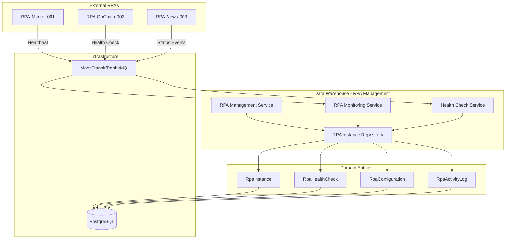
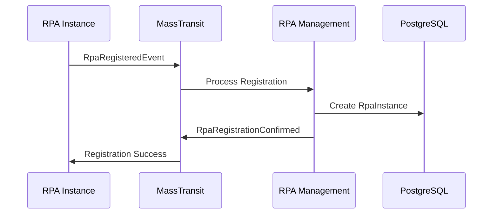
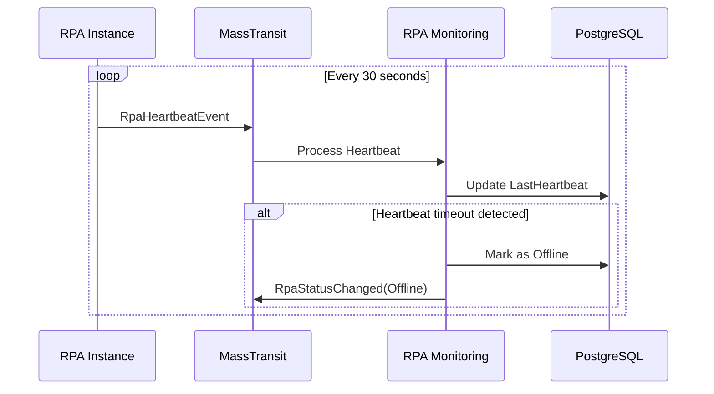
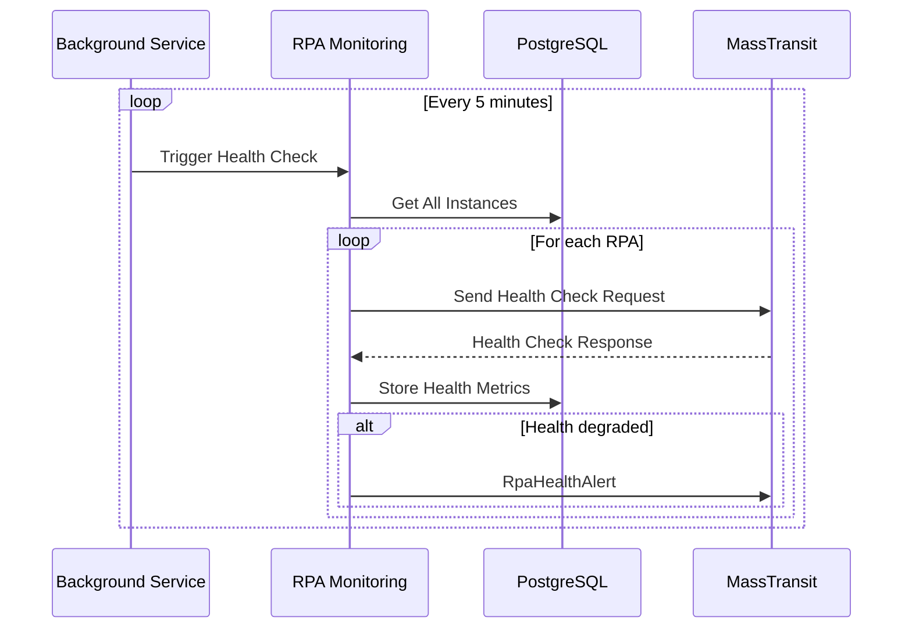

# 🤖 Gerenciamento de RPAs - Data Warehouse

## 📖 Visão Geral

Este documento detalha a implementação do **gerenciamento de instâncias RPA** dentro do módulo **Data Warehouse**, permitindo o controle completo do ciclo de vida dos RPAs (Robotic Process Automation) que coletam dados de mercado financeiro, criptomoedas e dados on-chain.

## 🏗️ Arquitetura de Gerenciamento



## 🔧 Entidades do Domínio

### **RpaInstance** - Entidade Principal
```csharp
public class RpaInstance : BaseEntity
{
    [Required]
    [MaxLength(100)]
    public string Name { get; set; } = null!;
    
    [Required]
    public RpaType Type { get; set; }
    
    [Required]
    public RpaInstanceStatus Status { get; set; }
    
    [Required]
    public DateTime LastHeartbeat { get; set; }
    
    [Required]
    public DateTime RegisteredAt { get; set; }
    
    public string? Description { get; set; }
    
    public string? Version { get; set; }
    
    [Range(1, 100)]
    public int MaxConcurrentRequests { get; set; } = 5;
    
    [Range(0, 100)]
    public int CurrentActiveRequests { get; set; } = 0;
    
    public List<string> Capabilities { get; set; } = new();
    
    // Métodos de Negócio
    public bool IsOnline()
        => Status == RpaInstanceStatus.Online && 
           DateTime.UtcNow.Subtract(LastHeartbeat) <= TimeSpan.FromMinutes(2);
    
    public bool CanAcceptNewRequest()
        => IsOnline() && CurrentActiveRequests < MaxConcurrentRequests;
    
    public void UpdateHeartbeat()
    {
        LastHeartbeat = DateTime.UtcNow;
        if (Status == RpaInstanceStatus.Offline)
            Status = RpaInstanceStatus.Online;
    }
    
    public void IncrementActiveRequests()
    {
        if (CurrentActiveRequests < MaxConcurrentRequests)
        {
            CurrentActiveRequests++;
            Status = CurrentActiveRequests >= MaxConcurrentRequests 
                ? RpaInstanceStatus.Busy 
                : RpaInstanceStatus.Online;
        }
    }
    
    public void DecrementActiveRequests()
    {
        if (CurrentActiveRequests > 0)
        {
            CurrentActiveRequests--;
            Status = RpaInstanceStatus.Online;
        }
    }
    
    public void MarkAsOffline()
    {
        Status = RpaInstanceStatus.Offline;
        CurrentActiveRequests = 0;
    }
}
```

### **RpaHealthCheck** - Monitoramento de Saúde
```csharp
public class RpaHealthCheck : BaseEntity
{
    [Required]
    public Guid RpaInstanceId { get; set; }
    
    [Required]
    public DateTime CheckTime { get; set; }
    
    [Required]
    public bool IsHealthy { get; set; }
    
    [Required]
    public TimeSpan ResponseTime { get; set; }
    
    [Range(0, 100)]
    public double SuccessRate { get; set; }
    
    public TimeSpan AverageResponseTime { get; set; }
    
    public int ErrorsInLastHour { get; set; }
    
    public TimeSpan Uptime { get; set; }
    
    public string? ErrorDetails { get; set; }
    
    // Relacionamento
    public virtual RpaInstance RpaInstance { get; set; } = null!;
}
```

## 🔌 Interfaces de Serviço

### **IRpaInstanceRepository** - Acesso aos Dados
```csharp
public interface IRpaInstanceRepository
{
    // CRUD Básico
    Task<RpaInstance?> GetByIdAsync(Guid id, CancellationToken cancellationToken = default);
    Task<RpaInstance> CreateAsync(RpaInstance rpaInstance, CancellationToken cancellationToken = default);
    Task UpdateAsync(RpaInstance rpaInstance, CancellationToken cancellationToken = default);
    Task DeleteAsync(Guid id, CancellationToken cancellationToken = default);
    
    // Consultas Específicas
    Task<List<RpaInstance>> GetAllAsync(CancellationToken cancellationToken = default);
    Task<List<RpaInstance>> GetByTypeAsync(RpaType type, CancellationToken cancellationToken = default);
    Task<List<RpaInstance>> GetOnlineInstancesAsync(CancellationToken cancellationToken = default);
    Task<List<RpaInstance>> GetAvailableInstancesAsync(CancellationToken cancellationToken = default);
    Task<List<RpaInstance>> GetInstancesByStatusAsync(RpaInstanceStatus status, CancellationToken cancellationToken = default);
    Task<RpaInstance?> GetByNameAsync(string name, CancellationToken cancellationToken = default);
    
    // Operações de Heartbeat
    Task UpdateHeartbeatAsync(Guid rpaInstanceId, CancellationToken cancellationToken = default);
    Task MarkAsOfflineAsync(Guid rpaInstanceId, CancellationToken cancellationToken = default);
    Task<List<RpaInstance>> GetStaleInstancesAsync(TimeSpan heartbeatTimeout, CancellationToken cancellationToken = default);
}
```

### **IRpaInstanceManagementService** - Lógica de Negócio
```csharp
public interface IRpaInstanceManagementService
{
    // Gerenciamento do Ciclo de Vida
    Task<RegisterRpaInstanceResponse> RegisterInstanceAsync(RegisterRpaInstanceRequest request, CancellationToken cancellationToken = default);
    Task<UpdateRpaInstanceResponse> UpdateInstanceAsync(UpdateRpaInstanceRequest request, CancellationToken cancellationToken = default);
    Task<GetRpaInstanceResponse> GetInstanceAsync(Guid rpaInstanceId, CancellationToken cancellationToken = default);
    Task<DeleteRpaInstanceResponse> UnregisterInstanceAsync(Guid rpaInstanceId, CancellationToken cancellationToken = default);
    
    // Consultas e Listagens
    Task<List<RpaInstanceSummaryDto>> GetAllInstancesAsync(CancellationToken cancellationToken = default);
    Task<List<RpaInstanceSummaryDto>> GetInstancesByTypeAsync(RpaType type, CancellationToken cancellationToken = default);
    Task<List<RpaInstanceSummaryDto>> GetAvailableInstancesAsync(CancellationToken cancellationToken = default);
    Task<List<RpaInstanceSummaryDto>> GetInstancesByStatusAsync(RpaInstanceStatus status, CancellationToken cancellationToken = default);
    
    // Operações de Capacidade
    Task<RpaInstance?> GetBestAvailableInstanceAsync(RpaType type, List<string>? requiredCapabilities = null, CancellationToken cancellationToken = default);
    Task<bool> CanInstanceHandleRequestAsync(Guid rpaInstanceId, CancellationToken cancellationToken = default);
    
    // Gerenciamento de Requisições Ativas
    Task IncrementActiveRequestsAsync(Guid rpaInstanceId, CancellationToken cancellationToken = default);
    Task DecrementActiveRequestsAsync(Guid rpaInstanceId, CancellationToken cancellationToken = default);
}
```

### **IRpaMonitoringService** - Monitoramento e Saúde
```csharp
public interface IRpaMonitoringService
{
    // Processamento de Eventos
    Task ProcessHeartbeatAsync(RpaHeartbeatEvent heartbeat, CancellationToken cancellationToken = default);
    Task ProcessHealthCheckAsync(RpaHealthCheckEvent healthCheck, CancellationToken cancellationToken = default);
    Task ProcessStatusChangeAsync(RpaStatusChangedEvent statusChange, CancellationToken cancellationToken = default);
    
    // Consultas de Status
    Task<List<RpaInstanceHealthDto>> GetInstancesHealthStatusAsync(CancellationToken cancellationToken = default);
    Task<RpaInstanceHealthDto?> GetInstanceHealthAsync(Guid rpaInstanceId, CancellationToken cancellationToken = default);
    Task<bool> IsInstanceHealthyAsync(Guid rpaInstanceId, CancellationToken cancellationToken = default);
    
    // Detecção de Problemas
    Task<List<RpaInstance>> DetectStaleInstancesAsync(CancellationToken cancellationToken = default);
    Task MarkStaleInstancesAsOfflineAsync(CancellationToken cancellationToken = default);
    Task<List<RpaInstanceAlertDto>> GetActiveAlertsAsync(CancellationToken cancellationToken = default);
    
    // Métricas e Relatórios
    Task<RpaFleetMetricsDto> GetFleetMetricsAsync(CancellationToken cancellationToken = default);
    Task<RpaInstanceMetricsDto> GetInstanceMetricsAsync(Guid rpaInstanceId, DateTime fromDate, DateTime toDate, CancellationToken cancellationToken = default);
}
```

## 📊 DTOs de Transferência

### **Request DTOs**
```csharp
public record RegisterRpaInstanceRequest(
    string Name,
    RpaType Type,
    string? Description = null,
    string? Version = null,
    int MaxConcurrentRequests = 5,
    List<string>? Capabilities = null
);

public record UpdateRpaInstanceRequest(
    Guid RpaInstanceId,
    string? Name = null,
    string? Description = null,
    string? Version = null,
    int? MaxConcurrentRequests = null,
    List<string>? Capabilities = null
);
```

### **Response DTOs**
```csharp
public record RegisterRpaInstanceResponse(
    bool Success,
    Guid? RpaInstanceId = null,
    string? ErrorMessage = null
);

public record RpaInstanceSummaryDto(
    Guid Id,
    string Name,
    RpaType Type,
    RpaInstanceStatus Status,
    DateTime LastHeartbeat,
    int CurrentActiveRequests,
    int MaxConcurrentRequests,
    bool IsOnline,
    List<string> Capabilities
);

public record RpaInstanceHealthDto(
    Guid RpaInstanceId,
    string Name,
    bool IsHealthy,
    TimeSpan? LastResponseTime,
    double SuccessRate,
    int ErrorsInLastHour,
    TimeSpan Uptime,
    DateTime LastHealthCheck
);

public record RpaFleetMetricsDto(
    int TotalInstances,
    int OnlineInstances,
    int OfflineInstances,
    int BusyInstances,
    double OverallHealthPercentage,
    int TotalActiveRequests,
    int TotalCapacity
);
```

## 🎯 Enumerações

### **RpaType** - Tipos de RPA
```csharp
public enum RpaType
{
    MarketData = 1,
    OnChainData = 2,
    NewsData = 3,
    SocialData = 4,
    CustomData = 5
}
```

### **RpaInstanceStatus** - Status da Instância
```csharp
public enum RpaInstanceStatus
{
    Offline = 0,
    Online = 1,
    Busy = 2,
    Error = 3,
    Maintenance = 4
}
```

## 🚀 Eventos de Domínio

### **RpaRegisteredEvent**
```csharp
public record RpaRegisteredEvent : DomainEvent
{
    public Guid RpaInstanceId { get; init; }
    public string Name { get; init; } = null!;
    public RpaType Type { get; init; }
    public DateTime RegisteredAt { get; init; }
    public List<string> Capabilities { get; init; } = new();
    
    public override string EventType => "rpa.registered";
}
```

### **RpaHeartbeatEvent**
```csharp
public record RpaHeartbeatEvent : DomainEvent
{
    public Guid RpaInstanceId { get; init; }
    public RpaInstanceStatus Status { get; init; }
    public int ActiveRequests { get; init; }
    public DateTime Timestamp { get; init; }
    public double? CpuUsage { get; init; }
    public double? MemoryUsage { get; init; }
    
    public override string EventType => "rpa.heartbeat";
}
```

### **RpaHealthCheckEvent**
```csharp
public record RpaHealthCheckEvent : DomainEvent
{
    public Guid RpaInstanceId { get; init; }
    public bool IsHealthy { get; init; }
    public TimeSpan ResponseTime { get; init; }
    public double SuccessRate { get; init; }
    public int ErrorsInLastHour { get; init; }
    public DateTime CheckTime { get; init; }
    
    public override string EventType => "rpa.health.check";
}
```

## 🔄 Fluxos de Trabalho

### **1. Registro de Nova Instância RPA**


### **2. Monitoramento de Heartbeat**


### **3. Health Check Automático**


## 🛠️ Implementação de Exemplo

### **RPA Management Service**
```csharp
public class RpaInstanceManagementService : IRpaInstanceManagementService
{
    private readonly IRpaInstanceRepository _repository;
    private readonly IDomainEventPublisher _eventPublisher;
    private readonly ILogger<RpaInstanceManagementService> _logger;

    public async Task<RegisterRpaInstanceResponse> RegisterInstanceAsync(
        RegisterRpaInstanceRequest request, 
        CancellationToken cancellationToken = default)
    {
        try
        {
            // Validar se nome já existe
            var existingInstance = await _repository.GetByNameAsync(request.Name, cancellationToken);
            if (existingInstance != null)
            {
                return new RegisterRpaInstanceResponse(false, ErrorMessage: "Nome já está em uso");
            }

            // Criar nova instância
            var rpaInstance = new RpaInstance
            {
                Id = Guid.NewGuid(),
                Name = request.Name,
                Type = request.Type,
                Description = request.Description,
                Version = request.Version,
                MaxConcurrentRequests = request.MaxConcurrentRequests,
                Capabilities = request.Capabilities ?? new List<string>(),
                Status = RpaInstanceStatus.Online,
                RegisteredAt = DateTime.UtcNow,
                LastHeartbeat = DateTime.UtcNow
            };

            var createdInstance = await _repository.CreateAsync(rpaInstance, cancellationToken);

            // Publicar evento
            await _eventPublisher.PublishAsync(new RpaRegisteredEvent
            {
                RpaInstanceId = createdInstance.Id,
                Name = createdInstance.Name,
                Type = createdInstance.Type,
                RegisteredAt = createdInstance.RegisteredAt,
                Capabilities = createdInstance.Capabilities
            }, cancellationToken);

            return new RegisterRpaInstanceResponse(true, createdInstance.Id);
        }
        catch (Exception ex)
        {
            _logger.LogError(ex, "Erro ao registrar instância RPA {Name}", request.Name);
            return new RegisterRpaInstanceResponse(false, ErrorMessage: "Erro interno do servidor");
        }
    }
}
```

## 📈 Métricas e Monitoramento

### **Métricas Coletadas**
- **Uptime**: Tempo online de cada instância
- **Throughput**: Requisições processadas por minuto
- **Success Rate**: Percentual de sucesso das operações
- **Response Time**: Tempo médio de resposta
- **Resource Usage**: CPU e memória utilizadas
- **Error Rate**: Taxa de erros por hora

### **Alertas Automáticos**
- **Instância Offline**: Sem heartbeat por > 2 minutos
- **High Error Rate**: > 10% de erros em 1 hora
- **High Response Time**: > 30 segundos médio
- **Resource Exhaustion**: CPU > 90% ou Memória > 95%
- **Capacity Warning**: > 80% das requisições máximas

## 🔒 Segurança e Validação

### **Validações de Negócio**
- Nome da instância deve ser único
- Máximo de 100 requisições simultâneas por instância
- Capabilities devem ser validadas contra lista permitida
- Heartbeat não pode ser mais antigo que 5 minutos

### **Controle de Acesso**
- Apenas usuários com role `RpaManager` podem registrar/remover instâncias
- Usuários com role `RpaOperator` podem visualizar status
- Eventos de sistema são auditados

---

## 📝 Considerações Finais

Este sistema de gerenciamento de RPAs fornece:

✅ **Controle completo** do ciclo de vida dos RPAs  
✅ **Monitoramento em tempo real** com alertas proativos  
✅ **Balanceamento automático** de carga entre instâncias  
✅ **Métricas detalhadas** para otimização de performance  
✅ **Recuperação automática** de instâncias com falha  
✅ **Escalabilidade horizontal** para adicionar novos RPAs  

A implementação segue os princípios do **Domain-Driven Design (DDD)** e está totalmente integrada com a arquitetura de eventos do Bot Sinais.
