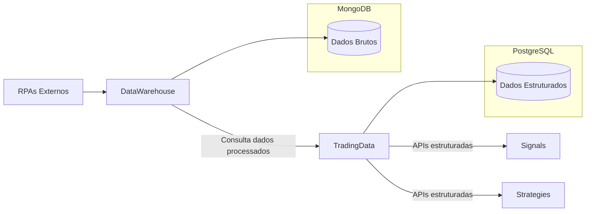

# 🔄 Renomeação de Módulo: DataManagement → TradingData

## 📋 Mudança Realizada

**Data**: 30 de julho de 2025  
**Módulo**: `DataManagement` → `TradingData`  
**Escopo**: Instruções do Copilot e documentação arquitetural  

## 🎯 Motivação da Mudança

### ❌ **Problema com "DataManagement"**
- Nome muito genérico e ambíguo
- Poderia confundir com DataWarehouse
- Não expressa claramente o propósito específico

### ✅ **Benefícios do "TradingData"**
- **Específico**: Deixa claro que são dados para trading
- **Diferenciado**: Não confunde com DataWarehouse
- **Intuitivo**: Desenvolvedores entendem imediatamente o propósito
- **Conciso**: Nome curto e direto
- **Escalável**: Permite crescimento natural do domínio

## 🏗️ Arquitetura de Módulos Atualizada

### **Antes** (4 módulos com ambiguidade)
```
📊 DataWarehouse    - Mar de dados + RPAs
📋 DataManagement   - ??? (nome ambíguo)
📈 Signals          - Sinais de trading
🔧 Strategies       - Estratégias
```

### **Depois** (4 módulos com responsabilidades claras)
```
📊 DataWarehouse    - Mar de dados + RPAs que depositam dados
📋 TradingData      - Dados estruturados para trading (APIs + repositórios)
📈 Signals          - Sinais de trading
🔧 Strategies       - Estratégias de trading
```

## 🔄 Fluxo de Dados Clarificado



## 📁 Namespaces Atualizados

### **Domain Layer**
```csharp
// ANTES
BotSinais.Domain.Modules.DataManagement.Entities
BotSinais.Domain.Modules.DataManagement.Interfaces
BotSinais.Domain.Modules.DataManagement.ValueObjects

// DEPOIS
BotSinais.Domain.Modules.TradingData.Entities     // ✅ Claro e específico
BotSinais.Domain.Modules.TradingData.Interfaces   // ✅ Propósito bem definido
BotSinais.Domain.Modules.TradingData.ValueObjects // ✅ Contexto evidente
```

### **Infrastructure Layer**
```csharp
// ANTES
BotSinais.Infrastructure.Modules.DataManagement

// DEPOIS
BotSinais.Infrastructure.Modules.TradingData      // ✅ Responsabilidade clara
```

## 🎯 Responsabilidades Específicas

### **DataWarehouse** (Inalterado)
- ✅ Gerenciamento de RPAs
- ✅ Coleta de dados brutos
- ✅ Armazenamento no MongoDB
- ✅ Controle de qualidade inicial

### **TradingData** (Renomeado)
- ✅ **Consulta dados do DataWarehouse**
- ✅ **Disponibiliza APIs para Signals/Strategies**
- ✅ **Gerencia entidades de trading** (Instrument, MarketData)
- ✅ **Fornece repositórios estruturados**
- ✅ **Entity Framework + PostgreSQL**

### **Signals** (Inalterado)
- ✅ Consome dados via TradingData
- ✅ Gera sinais de trading

### **Strategies** (Inalterado)
- ✅ Consome dados via TradingData
- ✅ Executa estratégias (C#, Python, Julia)

## 📝 Arquivos Atualizados

### **Documentação**
- ✅ `.github/copilot-instructions.md` - Atualizado completamente
- ✅ Todas as referências a `DataManagement` → `TradingData`
- ✅ Namespaces corrigidos em toda documentação
- ✅ Estrutura de módulos atualizada
- ✅ Configurações de DI atualizadas

### **Pendente (Código)**
- ⏳ Renomear pasta física: `DataManagement/` → `TradingData/`
- ⏳ Atualizar namespaces no código C#
- ⏳ Ajustar imports e referências
- ⏳ Atualizar configurações de Infrastructure

## 🚀 Próximos Passos

### **1. Implementação no Código**
```bash
# Renomear diretórios
mv Modules/DataManagement Modules/TradingData

# Atualizar namespaces (buscar e substituir)
# DataManagement → TradingData
```

### **2. Validação**
- ✅ Compilação sem erros
- ✅ Testes unitários passando
- ✅ Infrastructure configurada corretamente

### **3. Comunicação**
- ✅ Documentar mudança (este arquivo)
- ✅ Atualizar README se necessário
- ✅ Comunicar à equipe

## 🎨 Benefícios Esperados

### **📈 Clareza Arquitetural**
- Responsabilidades de cada módulo ficam evidentes
- Fluxo de dados mais compreensível
- Onboarding de novos desenvolvedores mais fácil

### **🔧 Manutenibilidade**
- Código mais organizizado por contexto específico
- Redução de acoplamento conceitual
- Evolução independente dos módulos

### **📚 Documentação**
- Instrussões do Copilot mais precisas
- Padrões arquiteturais mais claros
- Exemplos de código mais representativos

---

## ✅ Conclusão

A renomeação de **DataManagement** para **TradingData** resolve a ambiguidade conceitual e estabelece uma arquitetura de módulos mais clara e específica:

```
DataWarehouse → TradingData → Signals/Strategies
    (RPAs)      (APIs)       (Consumidores)
```

**A mudança melhora significativamente a expressividade do domínio e a compreensão da arquitetura!** 🎯
